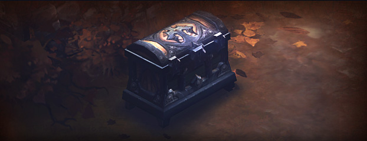

# Stash

Stash is a personal storage chest. Its main purpose is to store items. In this case anything I might find interesting in the computer world.

This is a little hobby I'm starting to archive some of things I create and do or come accross online that I might want to re-visit at a later stage or refer people to. Sharing is caring, so I guess we can call this a shared stash.

So please feel free to [contribute or submit corrections](https://github.com/coenraadhuman/stash). I would love to learn from the community.

 

[Diablo III Chest](https://eu.diablo3.blizzard.com/en-gb/blog/10030838/aimer-c%E2%80%99est-partager-le-coffre-commun-13-09-2011)